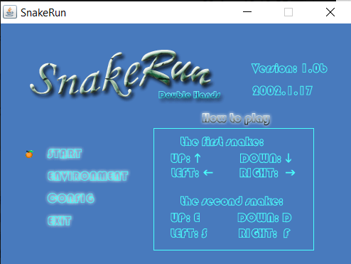
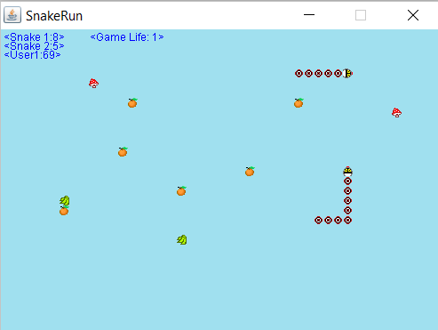

# SnakeRun
SnakeRun game with Java (In 2001-2002). This is a old time game and you can control one or two snakes on the screen to eat different fruits. Those fruit can make your snake longer or shorter.

This project is a computer game that can be played for one person or multiplayer (online version). The main character of the game is a snake that eats fruit (randomly or disappears) on the screen. A snake is represented by a line of multiple dots of the same size, and each point in its body follows the trajectory of the previous point, where the snake's head is the source of power. Each fruit eaten (color-determining function), the snake's nodes will increase or decrease (above the first stage goal); when the number of fruits eaten reaches a number, split into two snakes, the player operates with both hands (the second stage goal); and on the above, the four users on the network compete for the game (the third stage goal). When the fruit you eat reaches a value, you can pass, and the obstacle settings at each pass are different.

Snakes can go in four directions ( north, south, west, east Run, and the four walls are connected, the purpose is to eat the fruit to the integral, fruit color, effect and score as follows:

Color

Effect

Score

Green

Snake body plus a section

8

Orange

Snake body minus a section

5

Red

Bonus only

3

Table 1st : Food table

From the second pass, there are obstacles appear, once the snake contact to reduce one life, a total of three lives. The head of a snake can not touch its body, otherwise it will reduce a life.

Points 200 After going to the next level, speed up 10 ( Thread.sleep (.) The parameters in minus 10 .

Phase 2:

Points reached 200 After the snake body split into two parts, with left and right hand to operate, the operation of the keys see the following table:

Direction

Left

Right

North (up)

E

Cursor-up

South (down)

D

Cursor-down

West (left)

S

Cursor-left

East (right)

F

Cursor-right

Table 2 : Keyboard operating table

After the split, the two snakes score separately. 70 Points are clear.

Phase 3:

Supply the function of online game, in the above two stages of implementation, on the basis of the four players can play at the same time, that is, up to eight snakes appear on the screen.
